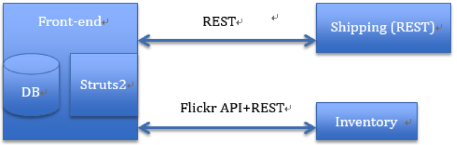
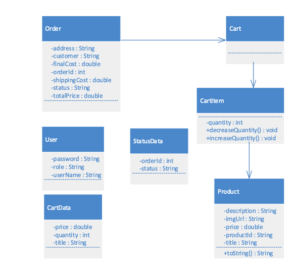
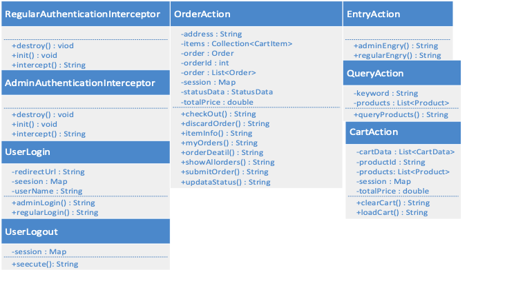
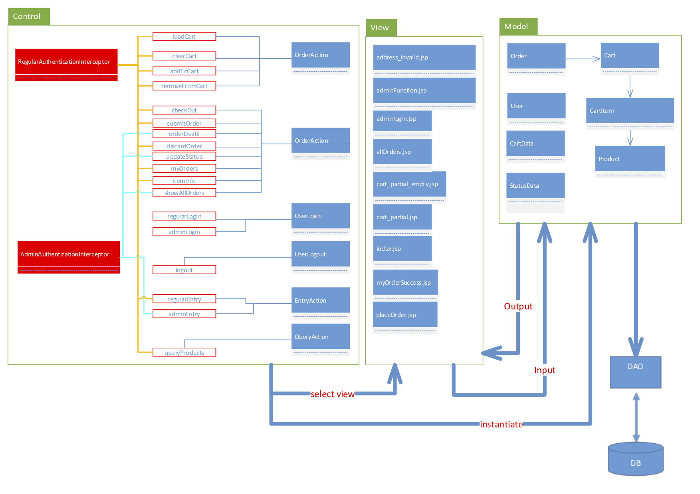

# eCommerce System

## 0x00 System Function Description

A simple E-Commerce System consists of three components: a **web front end** powered by Tomcat running on local host, a **shipping** component running on a separate server within the same administrative domain and an **inventory** component running on third party premises. The inventory component provides basic product information such as product id, name and price. Suppose our simple E-Commerce System specialises in selling photos. We use **[flickr.com][1]** to simulate an inventory component and communicate with it through flickr API.

The web front end allows **regular users** who have registered to search for product information and to add/remove desirable products in a shopping cart. Once a user is ready to check out, she needs to provide a delivery address. The pending order will be sent to a shipping component to calculate the shipping fee based on delivery address as well as number of items in the shopping cart. An order will be accepted and stored in the Database if the delivery address is valid. A user can place multiple orders. She can view all her orders from the web front end. The web front end also allows administrators to view all orders placed by regular users, and look at the details of each order such as order line items, quantity, shipping address and fee, and final cost. An administrator can update an order’s status. A newly placed order is always in "processing" status. It can be moved to "shipped" or "delivered" status by an **administrator**.

The product information is fetched dynamically from **[flickr.com][1]** using **[flickr.photos.search][2]** API. For a given keyword, this API returns a large number of photos matching the keywords. You only need to display a few (for instance, 10) that can fit in one page. No paging through feature is required in this project. Each photo is a product that can be purchased in your E-Commerce System. Please use photo_id as the product id, photo title as the product title, and the list of tags as product description. The actual photo should be displayed using its flickr based URL. Please compute price based on the number of tags each photo has. Set a base price for photos with no tags. For instance, if a photo has 6 tags and each tag costs $1.00, with a base price of $3.00, this photo’s price would be $9.00. Photo URL, photo_id, photo title and photo tags can be obtained from a single **[flickr.photos.search][2]** API call.

The shipping component is running on a separate server. It exposes a SOAP or RESTful API for shipping cost calculation. The API accepts a pending order and returns the shipping cost for it. It stores a list of city name and corresponding delivery cost. In addition there is a fixed per item shipping cost. For instance, if the per item shipping cost is $0.99 and the delivery cost to Sydney is $7.95, an order with 10 photos sent to Sydney would have a total shipping fee of $17.85. The shipping component returns a shipping fee if the city name of delivery address is in its list, or it returns an error message indicating the address is not valid. When invalid address error is returned, a user can either discard the order or enter a new delivery address. Discarding the order will reset the shopping cart and return user to the query form. You can preload the per-item shipping cost and a list of city name/delivery cost from a file. The shipping component always prints to console its current states. Important states include: starting, receiving order and finishing cost computation. It should print out order details when it receives an order and the total cost or invalid delivery address exception after it computes the cost.

## 0x01 System Design

In this project, we use Struts2 framework to implement our web front-end component, RESTful style for the Shipping component and REST flickr API for the inventory component. The interaction between these three components is shown as the follow:

## 0x02 Model Classes UML Diagram

All of the classes in our model are JavaBeans, the purpose is to handle the data from the clients or database and easily display them in JSP page via Struts2 tags. Also by using JavaBean can convenient to communicate with different components via JSON or xml format. 

The following UML class diagram shows the models.

It should be mention that, the "User" class is use for authenticate and authorize a client. The user information is stored in the database, and the "CartData" & "StatusData" classes are used to display relevant data through AJAX call.

## 0x03 View JSP Table

This is View Part of MVC structure

| JSP Page                | Functions                      |
| ----------------------- | ------------------------------ |
| index.jsp	              | Index page                     |
| regularlogin.jsp        | Login page for regular user    |
| adminlogin.jsp          | Login page for admin user      |
| query.jsp               | Query page                     |
| queryresults.jsp        | Query results page             |
| orderSuccess.jsp        | Order success page             |
| address_invalid.jsp     | Error for invalid address page |
| myOrdersDetail.jsp      | My order detail page           |
| placeOrder.jsp          | Provide the address page       |
| itemInfo.jsp            | My order more detail page      |
| adminFunction.jsp       | Admin access page              |
| allOrder.jsps           | All orders page                |
| cart_partial.jsp        | Cart info for AJAX call        |
| cart_partical_empty.jsp |	No item in cart, AJAX call     |

## 0x04 Controller Classes UML Diagram

For the controller, since we logically group our action into three parts, which are "public", "regular" and "admin", we create two interceptors for access controller. One is "AdminAuthenticationInterceptor" used for intercepting the "admin" action, the other is "RegularAuthenticationInterceptor" used for intercepting the "regular" action. 

We have "CartAction" & "OrderAction" classes, which provide necessary action operations related to the cart and order. For example, when users click "add to cart", this invoked action is in the "CartAction", and when users click "submit the order", this invoked action is in the "OrderAction".

We also have "QueryAction" class to interact with the Flickr API. Besides, we have "EntryAction" class related to the entry operations and "UserLogin" & "UserLogout" class related to login and logout operation. The following UML class diagram shows all the controller classes in our front-end system.

## 0x05 MVC Interaction

This is about the interaction of different parts of "MVC" structure.

## 0x06 Folder Structure and Usage Instraction

- [ECommerce](./ECommerce) is the front-end component running on one server.

- [Shipping](./Shipping) is the Shipping component running on another server.

PLEASE RUN THE [ecommerce.sql](./ecommerce.sql) FIRST TO INITIALIZE THE DATABASE.

The database has three users:

| Username | Password | Role    |
| -------- | -------- | ------- |
| admin    | admin    | admin   |
| user0    | user0    | regular |
| user1    | user1    | regular |

[1]: https://www.flickr.com/
[2]: https://www.flickr.com/services/api/flickr.photos.search.html